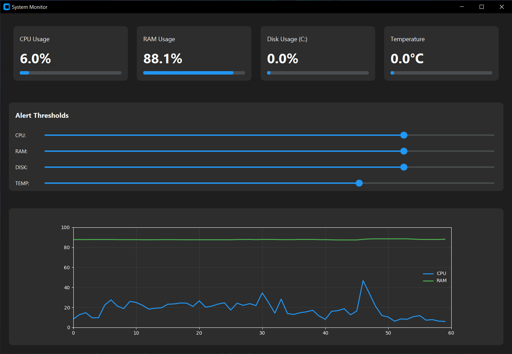

# Resource Alert 🚀

Monitor de recursos del sistema con interfaz gráfica moderna y sistema de alertas.



## ✨ Características

- 📊 **Monitoreo en tiempo real**:
  - Uso de CPU
  - Uso de RAM
  - Uso de Disco
  - Temperatura del CPU (cuando los sensores están disponibles)
- 📈 **Gráfico histórico** de CPU y RAM
- 🎨 **Interfaz moderna y oscura**
- 🎚️ **Umbrales personalizables** mediante controles deslizantes
- 🔔 **Sistema de notificaciones** con período de gracia
- 📊 **Visualización mediante tarjetas y barras de progreso**
- 📝 **Sistema de logging** completo

## 🛠️ Requisitos Previos

- Python 3.7 o superior
- Sistema operativo: Windows, Linux o macOS

## 🚀 Instalación

1. Clonar el repositorio:

```bash
git clone https://github.com/TU_USUARIO/Resource_Alert.git
cd Resource_Alert
```

2. Crear y activar entorno virtual:

```bash
# Windows
python -m venv .venv
.venv\Scripts\activate

# Linux/macOS
python3 -m venv .venv
source .venv/bin/activate
```

3. Instalar dependencias:

```bash
pip install -r requirements.txt
```

## 💻 Uso

1. Ejecutar la aplicación:

```bash
python monitor.py
```

2. La aplicación mostrará:

   - Tarjetas con métricas en tiempo real
   - Gráfico histórico de CPU y RAM
   - Controles deslizantes para ajustar umbrales

3. Las notificaciones se mostrarán cuando:
   - Se superen los umbrales configurados
   - Haya pasado el período de gracia (5 minutos por defecto)

## ⚙️ Configuración

Los umbrales se pueden ajustar en tiempo real usando los controles deslizantes:

- Valores predeterminados:
  - CPU: 80%
  - RAM: 80%
  - Disco: 80%
  - Temperatura: 70°C

## 📝 Logs

Los logs se guardan en:

- `logs/system_monitor.log`
- Rotación automática cuando alcanza 5MB
- Se mantienen los últimos 5 archivos de log

## 🤝 Contribuir

1. Fork el proyecto
2. Crear una rama para tu característica (`git checkout -b feature/AmazingFeature`)
3. Commit tus cambios (`git commit -m 'Add: nueva característica'`)
4. Push a la rama (`git push origin feature/AmazingFeature`)
5. Abrir un Pull Request

## 📄 Licencia

Distribuido bajo la Licencia MIT. Ver `LICENSE` para más información.

## 👤 Autor

Tu Nombre

- GitHub: [@tu_usuario](https://github.com/tu_usuario)

## ⭐️ Mostrar tu apoyo

¡Dale una estrella si este proyecto te ayudó!
